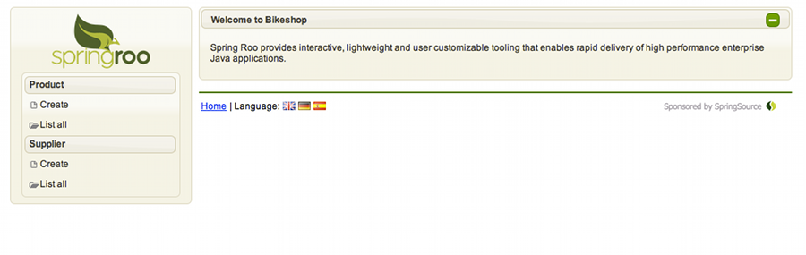

[[base-jsf]]
JavaServer Faces (JSF) Add-On
-----------------------------

The JSF add-on allows you to conveniently scaffold JSF managed beans and
XHTML views for an existing domain model. Currently this domain model is
derived from the Roo supported JPA integration through the entity jpa
and related field commands. The following features are included:

* Automatic update of JSF managed beans and converters reflecting
changes in the domain model
* Choice of either Oracle Mojarra or Apache MyFaces JSF 2
implementations
* Server-side validation based on JSR 303 constraints defined in the
domain layer
* Integration of http://primefaces.org/[PrimeFaces] JSF Component Suite,
including automatic scaffolding of PrimeFaces controls such as:
** AutoComplete
** Calendar
** FileUpload
** InputText
** InputTextarea
** Media
** SelectManyMenu
** Spinner
* User-selectable PrimeFaces themes

[[jsf-commands]]
JSF commands
------------

The JSF add-on contains four commands:

1.  -----------------------------------------------------
roo> web jsf setup --implementation --library --theme
-----------------------------------------------------
+
When this command is run for the first time in a single-module project
or an empty module, the necessary JSF artifacts are copied to the
project or module such as the pom dependencies and repositories and the
web.xml file. A default PrimeFaces theme called "south-street" is
configured as well in the web.xml.
+
The web jsf setup command can be run as many times as you like to change
the JSF implementation and the theme.
+
The --implementation option when specifed allows you to chouse either
the Oracle Mojarra or Apache MyFaces JSF implementations.
+
The --library option has only one selectable value, being PRIMEFACES.
+
The --theme option lets you select one of 30 PrimeFaces themes for your
UI.
2.  --------------------------
roo> web jsf all --package
--------------------------
+
The web jsf all command creates JSF managed beans and converters for all
entities in the specified package. A JSF XHTML page is also created in
the src/main/webapp/pages directory for each entity.
3.  -----------------------------------------------------------------
roo> web jsf scaffold --class --entity --beanName --includeOnMenu
-----------------------------------------------------------------
+
The web jsf scaffold command lets you create a managed bean for a
particular entity in your project.
+
The --class option is where you specify the name of the managed bean
class.
+
The --entity option lets you specify the entity for the managed bean and
is only required if the focus is not on the entity you want to create
the managed bean for.
+
If you do not wish the 'create' and 'list' menu selections to appear for
the entity in the menu on the generated UI, specify false in the
--includeOnMenu option.
4.  ---------------------------------
roo> web jsf media --url --player
---------------------------------
+
The web jsf media command is used for embedding multimedia content such
as videos and music on your JSF home page.
+
The --url option is where you specify the url of the the media content,
such as a YouTube video.
+
The media player used is automaticallly selected based on the url or
file extension of the media file in the url if applicable, however,
where this cannot be determined you can use the --player option to
select a suitable player.

The @RooJsfManagedBean annotation
---------------------------------

The @RooJsfManagedBean annotation is added to all new classes created by
the web jsf all and web jsf scaffold commands. The annotation causes the
introduction of the javax.faces.bean.ManagedBean and
javax.faces.bean.SessionScoped annotations in the *_Roo_ManagedBean.aj
ITD. Note that if you specify a scope other than @SessionScoped in the
managed bean .java file, the scope annotation is removed from the ITD.
For example, if you want your bean to be @RequestScoped, simply annotate
your managed bean with the @RequestScoped annotation.

Use the beanName attribute to force the naming of the managed bean
referred to by other beans and in XHTML pages.

As mentioned before, the includeOnMenu attribute when set to false
prevents the 'Create' and 'List all' menu selections for the entity from
showing in the UI's menu.

The @RooJsfConverter annotation
-------------------------------

When a new managed bean is created, a converter class is also created
containing the @RooJsfConverter annotation. The JSF converter class
implements the javax.faces.convert.Converter interface and has
implementations of the getAsObject and getAsString methods (introduced
in an ITD) to perform Object-to-String and String-to-Object conversions
between model data objects and a String representation of those objects
that is suitable for rendering.

The @RooJsfApplicationBean annotation
-------------------------------------

Whenever a managed bean is created for the first time, Roo will install
a class containing the @RooJsfApplicationBean annotation. The ITD
generated from this annotation contains the PrimeFaces menu with the
'Create' and 'List all' operations for each entity. Whenever a managed
bean is created, provding the @RooJsfManagedBean includeOnMenu attribute
is either not specifed or set to 'true', new menu selections are
automatically added to the *__Roo_ApplicationBean.aj ITD. Similarly,
when a managaed bean is deleted or the includeOnMenu attribute is set to
false, the menu selections are removed.

The bikeshop example
--------------------

The Roo distribution contains a script called bikeshop.roo that
demonstrates the JSF add-on capability. Please note that the --equals
attribute should be specified as true on the entity jpa command for all
entities intended to be scaffolded with JSF. Alternatively, add the
@RooEquals annotation to existing entities.

In the Roo shell, type:

------------------------
roo> script bikeshop.roo
------------------------

When complete, exit the shell and run Jetty as follows:

----------------------
mvn jetty:run-exploded
----------------------

View the application at http://localhost:8080/bikeshop:

